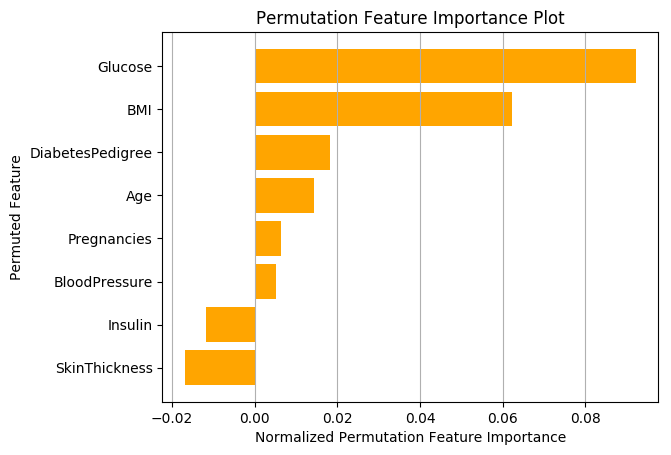
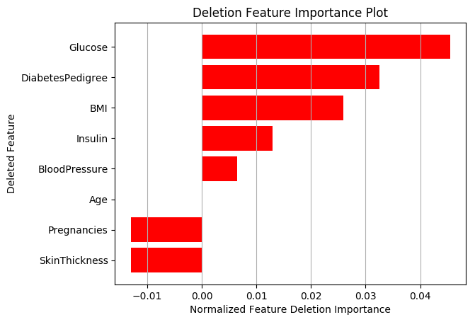
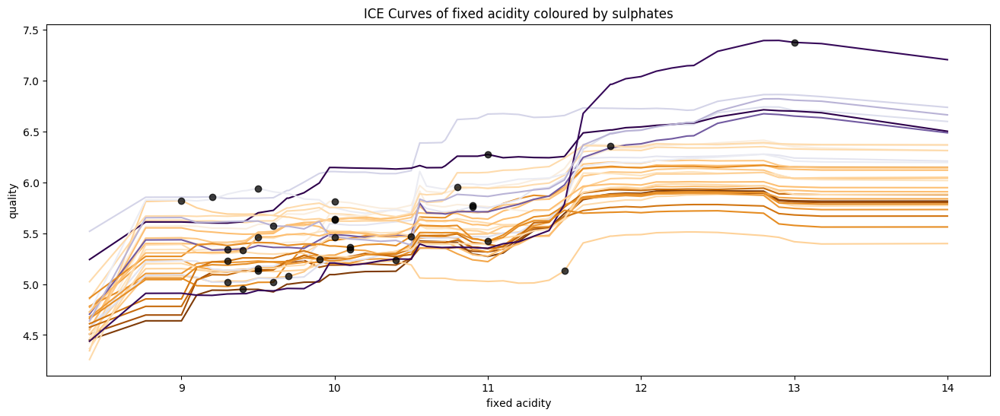
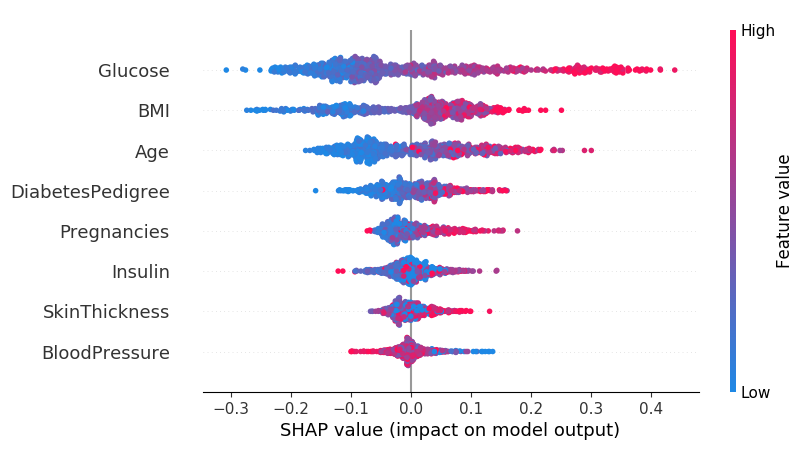
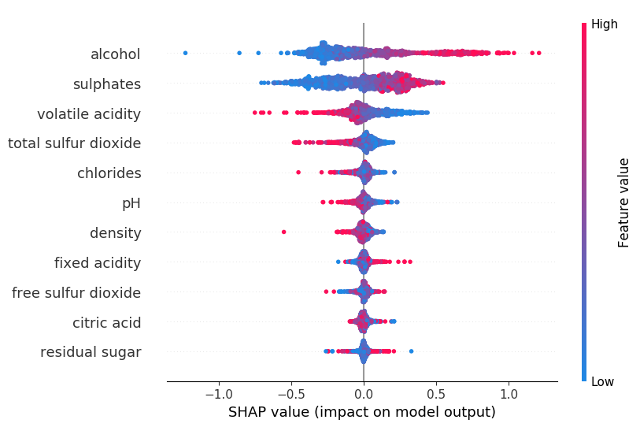
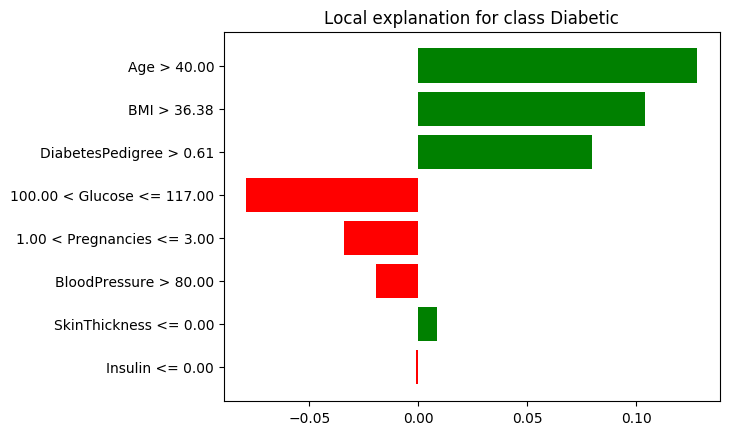

# eXplAIners
Steps and Explorations in Interpretable / Explainable AI

## Table of Contents
- [Feature Manipulations](#feature-manipulations)
- [Individual Conditional Expectations (ICE)](#individual-conditional-expectations)
- [Partial Dependence Plots (PDP)](#partial-dependence-plots)
- [Shapley Values](#shapley-values)
- [Local Interpretable Model-Agnostic Explanations (LIME)](#local-interpretable-model-agnostic-explanations)

The trained machine learning model will be referred to as the **underlying model**.

### Traditional Machine Learning Methods (Classification and Regression)
#### Feature Manipulations
The underlying model is run multiple times with different feature combinations, to get an estimate of the contribution of each feature.

A [`RandomForestClassifier`](https://scikit-learn.org/stable/modules/generated/sklearn.ensemble.RandomForestClassifier.html) (from `sklearn.ensemble`) is used as the underlying model for experiments on direct feature manipulations.

##### Feature Importance
This uses the [`feature_importances_`](https://scikit-learn.org/stable/auto_examples/ensemble/plot_forest_importances.html) attribute of the ensemble methods in Scikit Learn which is calculated by the _Mean Decrease in Impurity (MDI)_.

  where

 The importance of node ,

 = The weight of samples reaching node ,

 = The impurity of node ,

 = The child node from left split on node ,

 = The child node from right split on node ,

##### Feature Permutations
Here, for each feature in  the feature  is **permuted** (values are shuffled randomly), the model is retrained and the mean drop in accuracy (MDA) is measured to ascertain the importance of the feature. This was also performed on the [Diabetes Dataset](https://www.kaggle.com/uciml/pima-indians-diabetes-database).

##### Feature Deletions
Here, for each feature in  the feature  is **completely deleted**, the model is retrained and the mean drop in accuracy (MDA) is measured to ascertain the importance of the feature. This was done on the [Diabetes Dataset](https://www.kaggle.com/uciml/pima-indians-diabetes-database).

#### Individual Conditional Expectations
Individual Conditional Expectation (ICE) are a local per-instance method really useful in revealing feature interactions. 
They display one line per instance that shows how the instance’s prediction changes when a feature changes.

Formally, in ICE plots, for each instance in  the curve  is plotted against  while  remains fixed.

The  are the feature vectors for which the ICE must be plotted and  are the other features used in the underlying machine learning model 

In these examples, the underlying model  used is a [`RandomForestRegressor`](https://scikit-learn.org/stable/modules/generated/sklearn.ensemble.RandomForestRegressor.html)

Examples from the [Wine Quality Dataset](https://archive.ics.uci.edu/ml/datasets/wine+quality) are shown below.

#### Partial Dependence Plots
Partial dependence plots (short PDP or PD plot) shows the marginal effect one or two features have on the predicted outcome of a machine learning model.
A partial dependence plot can show whether the relationship between the target and a feature is linear, monotonic or more complex.

For regression, the partial dependence function is:

Again,  are the feature vectors for which the ICE must be plotted and  are the other features used in the underlying machine learning model  and the set  which is usually small and consists only of one or two features.

The partial function  is calculated as follows:

The partial function tells us for given value(s) of features  what the average marginal effect on the prediction is.

The underlying model  used here is a shallow (1 hidden layer) Neural Network, an [`MLPClassifier`](https://scikit-learn.org/stable/modules/generated/sklearn.neural_network.MLPClassifier.html) with around 25 neurons in the hidden layer and the dataset used is the [`BankNotes Authentication Dataset`](https://archive.ics.uci.edu/ml/datasets/banknote+authentication).

#### Shapley Values
This idea comes from game theory and gives a theoretical estimate of feature prediction as compared to the above methods which were empirical and also gives importance to the sequence of features introduced.

The contribution of feature  given the value function or **underlying model**  is given as follows:

where  is a subset of the feature set  and  gives the total model contribution of the subset .

The underlying model  used for this experiment is a [`RandomForestRegressor`](https://scikit-learn.org/stable/modules/generated/sklearn.ensemble.RandomForestRegressor.html) on the [Diabetes](https://www.kaggle.com/uciml/pima-indians-diabetes-database) and the [Wine Quality](https://archive.ics.uci.edu/ml/datasets/wine+quality) datasets.

<h5><ins>Diabetes Dataset</ins></h5>

<h5><ins>Wine Quality Dataset</ins></h5>

#### Local Interpretable Model-Agnostic Explanations
Local Interpretable Model-Agnostic Explanation (LIME) 
is a black-box **model agnostic** technique, which means it is independent of the underlying model used. It is however, **local** in nature, and generates an approximation and explanation for each example/instance of data. The explainer tries to perturb model inputs which are more interpretable to humans and then tries to generate a linear approximation _locally_ in the neighbourhood of the prediction.

In general, the overall objective function is given by

where  is the explainer function/model,

 defines the locality/neighbourhood,

 defines the deviation or loss (or unfaithfulness) from the predictions of the actual model ,

 is the class/family of explainable functions.

These are better illustrated by examples:
(Examples on the [Diabetes](https://www.kaggle.com/uciml/pima-indians-diabetes-database) and the [Wine Quality](https://archive.ics.uci.edu/ml/datasets/wine+quality) datasets)

Probability of being Diabetic: 0.56

Prediction: Diabetic

Predicted Wine Quality: 5.8 / 10

### Deep Learning Methods
Coming Soon!
